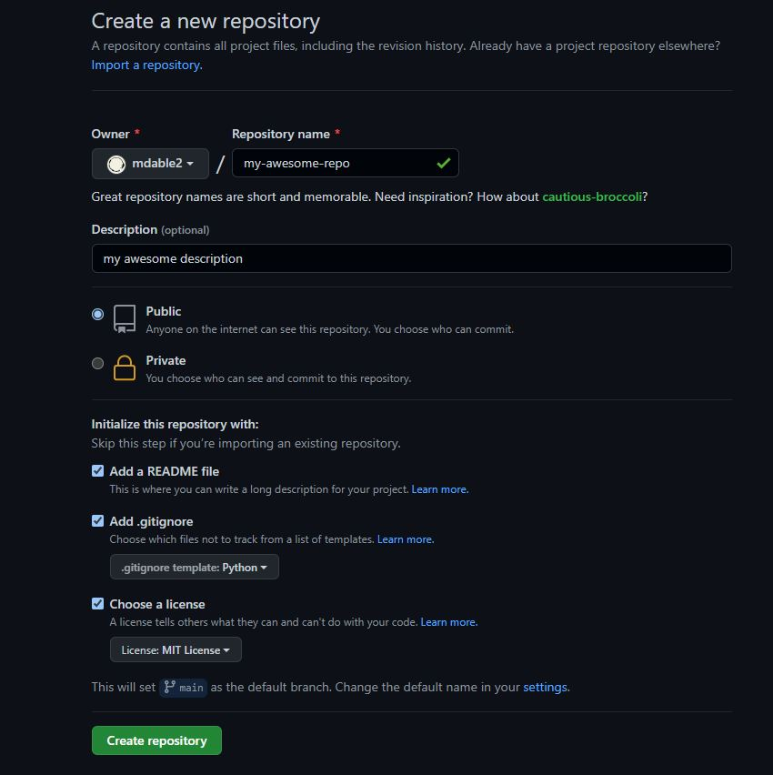

# Welcome to MLOps Cohort 3 (March 2022)!

# Getting Started
Hello and welcome to the ML Ops course! Follow these steps to get your environment set up and review basic terminal skills. At the end you'll have your first project set up and ready to go.

1. Install [Anaconda](https://www.anaconda.com/products/individual).
2. Install [Git](https://git-scm.com/downloads).
3. Install [VS Code](https://code.visualstudio.com/download).
4. If you don't already have one, make an account on [Github](https://github.com/). Then login and navigate to the top right user icon, click it, go to repositories, 
   

and then click "New" (the green button).

5. Create the repository by inputting the following:
* Repo name
* Repo description
* Make repo public
* Add a README
* Add .gitignore (Python template)
* Add license (choose MIT)

Then hit "Create Repository".

6. Now that you have a repo, go to the code section and copy the HTTPS address so you can clone your repo to your local computer.

